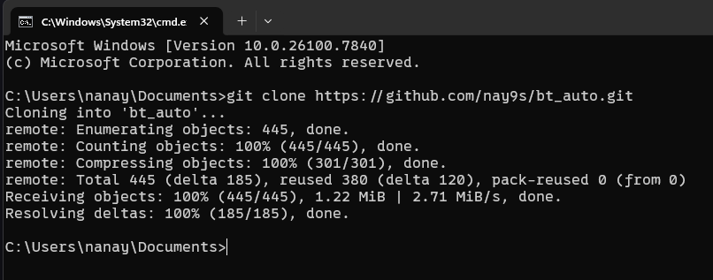
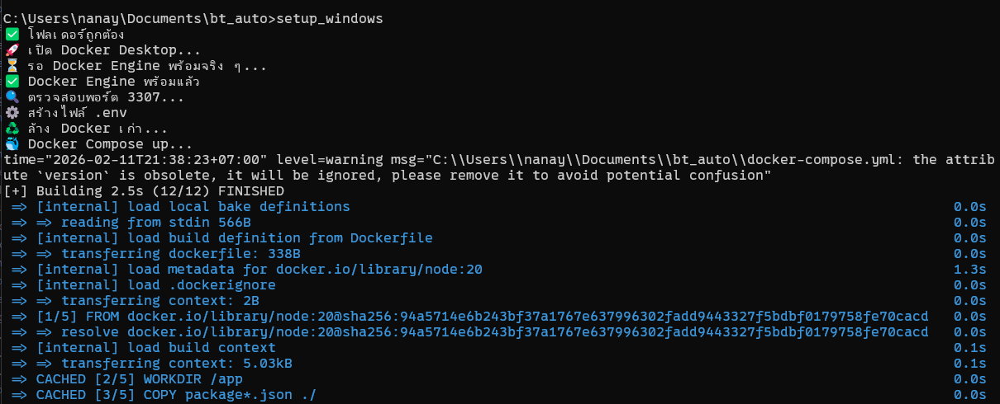
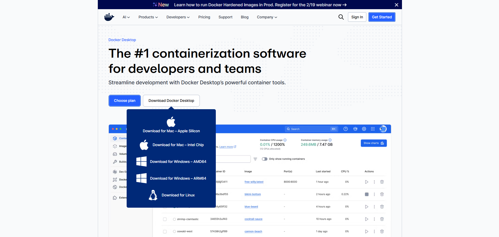
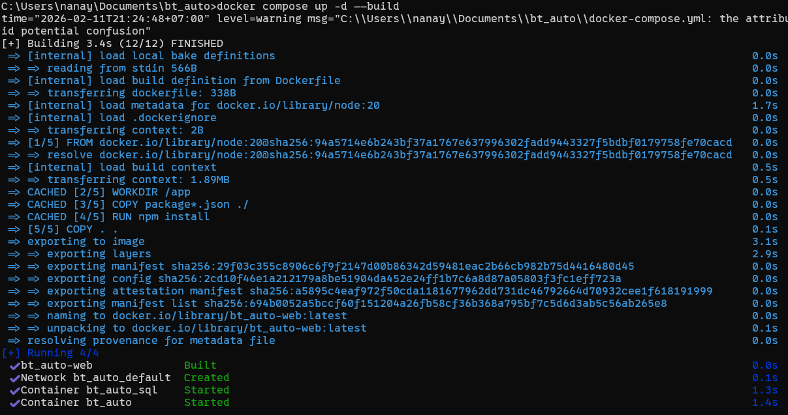
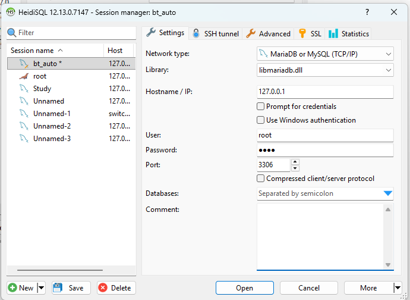

# การติดตั้ง
[1.การติดตั้งแบบง่าย (Easy)](#การติดตั้งแบบง่าย)

[2.การติดตั้งด้วยตนเอง (Manual)](#การติดตั้งด้วยตนเอง (Manual))


# การติดตั้งแบบง่าย
#1. ทำการ Clone Project ใน Command Line โดยใช้คำสั่ง

`git clone https://github.com/nay9s/bt_auto.git`



#2. เข้าไปยัง Project โดยใช้คำสั่ง `cd bt_auto` 

### ใน Windows 

#1. ใช้คำสั่ง `setup_window` 

หลังจากนั้นระบบจะทำการติดตั้งให้โดยอัตโนมัติ สามารถดูวิธีการใช้งานได้ที่ [วิธีการใช้งาน](#การเริ่มต้นใช้งาน)



### ใน Mac
#1. ใช้คำสั่ง `chmod +x setup_mac.sh`

#2. ใช้คำสั่ง `setup_mac.sh` 

หลังจากนั้นระบบจะทำการติดตั้งให้โดยอัตโนมัติ สามารถดูวิธีการใช้งานได้ที่ [วิธีการใช้งาน](#การเริ่มต้นใช้งาน)

# การติดตั้งด้วยตนเอง
#1. ติดตั้ง Docker Desktop โดยสามารถ Download ได้ที่ https://www.docker.com/products/docker-desktop/



#2. ทำการ Clone Project ใน Command Line โดยใช้คำสั่ง

`git clone https://github.com/nay9s/bt_auto.git`


#3. เข้าไปยัง Project โดยใช้คำสั่ง `cd bt_auto` 

#4. ทำการสร้างไฟล์ .env โดยใช้คำสั่ง
```
(echo DB_HOST=mysql 
echo DB_USER=user
echo DB_PASSWORD=pass
echo DB_NAME=bt_auto
echo DB_PORT=3306
) > .env
```
#5. ทำการเปิด Docker Desktop แล้วพิมพ์คำสั่ง `docker compose up -d --build` ใน Command Line




#6. หากต้องการแก้ไขฐานข้อมูลสามารถใช้ SQL Management Tools ในการจัดการ หรือใช้คำสั่ง SQL ในตัวอย่าง HeidiSQL ในการจัดการ โดยตั้งค่า `User : user` `Password : pass` `Port : 3306`




# การเริ่มต้นใช้งาน
#1. เข้าไปยัง Folder Project โดยใช้ `cd bt_auto`

#2. ทำการใช้คำสั่ง `docker compose up` เพื่อเปิดใช้งาน Server

#3. หากต้องการเปิดการใช้งานใช้คำสั่ง `docker compose down`

# คู่มือผู้ใช้งาน
[ดูได้ที่นี่ : คู่มือผู้ใช้งาน](./how_to_install/userguide.pdf)

# รูปเล่มรายงาน
[ดูได้ที่นี่ : รูปเล่มรายงาน](./how_to_install/ระบบจัดการอู่ซ่อมรถรูปเล่ม.pdf)

# รายชื่อสมาชิกในกลุ่มและหน้าที่ที่รับผิดชอบ
### 1. นายณรงค์กรณ์ ต๊ะสุ 67026214 
(รูปเล่มรายงานครั้งที่ 1 / Frontend : Register , Login / Backend : ทั้งหมด)

### 2. นายณัฐวุฒิ กล้าจริง 67021725 
(รูปเล่มรายงานครั้งที่ 2 / Frontend : )

### 3. นายพัชรพล ชัยโย 67021972 
(Frontend : หน้าแรก , หน้าหลัก , สถานะรถ , ประวัติบริการ , ติดต่ออู่)

### 4. นายอัรฟาน อาแว 67022456 
(Mockup / Frontend : แดชบอร์ด(Admin) , การเงิน(Admin) , รถยนต์(Admin))

### 5. นางสาวปิยนันท์ อานุนามัง 67026247 
(Mockup / Frontend : ลูกค้า(Admin) , ใบสั่งซ่อม(Admin) , สินค้า(Admin) / User Guide)